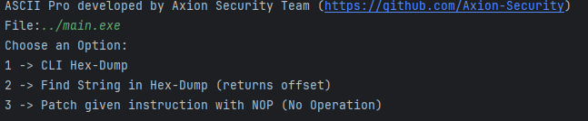

# ASCII PRO

ASCII Pro is a powerful reverse engineering tool written in C++ that enables users to perform various operations on binary files. This tool is specifically designed for reverse engineering tasks, providing functionality to analyze, modify, and annotate binary data effectively.

## Features

### 1. Read Binary Files
- Reads binary files into a vector of unsigned characters for analysis and manipulation.

### 2. Hex Dump with ASCII
- Displays a hex dump of the binary content with an ASCII interpretation.

### 3. String Search
- Searches for a specific string within the binary content.
- Returns the offset of the string if found.

### 4. Patch Instructions
- Identifies and patches a given instruction pattern in the binary file.
- Replaces the identified pattern with NOP (No Operation) instructions.

### 5. Save Patched Files
- Saves the modified binary content to a new file for further use.

### 6. Hex Pattern Search
- Searches for a specific hex pattern within the binary content.

### 7. Hex Input Parsing
- Parses a string of hex values into a vector of unsigned characters for efficient processing.

### 8. Annotation with Context
- Annotates a specific offset in the binary content with a description.
- Provides contextual information around the annotated offset.

## Modules

#### 1. **Hex Dump**
- Displays a hex dump of the binary file with highlighted values.

#### 2. **Find String in Hex Dump**
- Searches for a specific string in the binary content and returns its offset.

#### 3. **Patch Instruction**
- Patches a specified instruction pattern in the binary file with NOP instructions.
- Saves the patched file to a new location.

## Applications
This tool is particularly useful for reverse engineering tasks, such as:

- Analyzing binary files.
- Identifying and modifying specific instructions within binaries.
- Understanding the structure and layout of binary data.
- 
## License
This project is open-source and available under this [License](LICENSE).